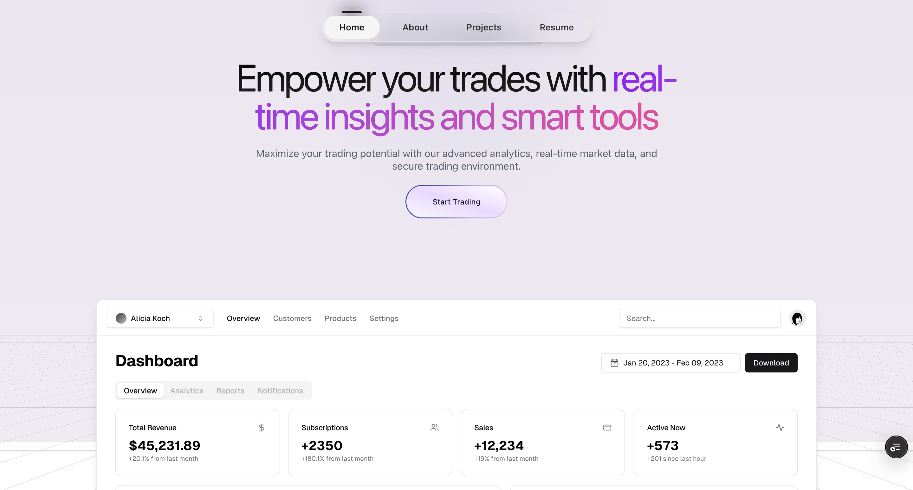
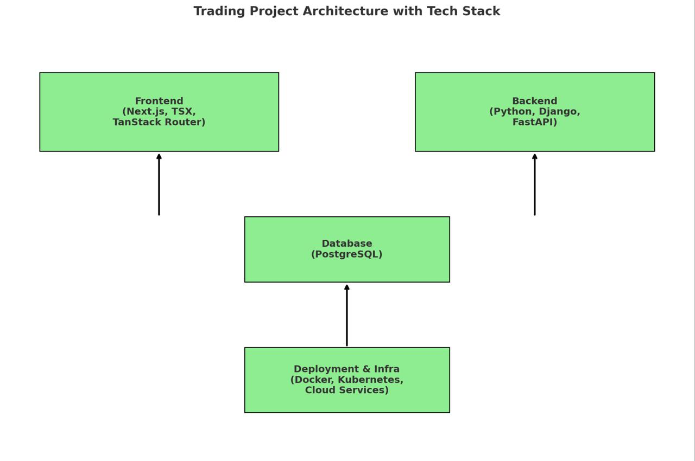

# Trading Project

A modern, scalable, and secure trading platform built with Next.js, Python (Django + FastAPI), and PostgreSQL, designed for real-time market data, interactive trading, and portfolio management.

---


---
---


---
## Project Overview

This project consists of:

- Frontend: Responsive UI for users to trade, view market data, and manage portfolios.
- Backend: Handles authentication, order execution, real-time data, and integrates with external trading platforms.
- Database: Stores users, accounts, trades, orders, market data, and portfolio holdings reliably.

---

## Frontend

Framework: Next.js with TypeScriptX (TSX)
Routing: TanStack Router for type-safe client-side navigation
Styling: Tailwind CSS + shadcn/ui components

Key Features:
- Real-time market data display
- User authentication & authorization
- Interactive trading interface
- Portfolio tracking & performance analysis
- Fully responsive design

Setup Example:
npx create-next-app@latest client
# Configure: TypeScript → Yes, Tailwind → Yes, App Router → Yes, Turbopack → NO
cd client
npx shadcn-ui init

---

## Backend

Language: Python
Frameworks: Django & FastAPI
Description: Django manages core application logic, user accounts, admin panel, and security. FastAPI provides high-performance, asynchronous APIs for real-time trading features.

Backend Services:
- User authentication & session management
- Order processing & execution
- Market data aggregation & distribution
- Account management & transaction history
- Integration with external trading platforms

Setup Example:
python3 -m venv venv
source venv/bin/activate
pip install django djangorestframework fastapi uvicorn psycopg2
django-admin startproject core
uvicorn main:app --reload

---

## Database

System: PostgreSQL
Description: Robust relational database for storing trading data with strong concurrency handling and JSON support.

Schema (Conceptual):
- Users
- Accounts
- Orders
- Trades
- Market Data
- Portfolio Holdings

---


## Project Structure (Proposed)
```
trading-project/
│── client/              # Frontend (Next.js + TSX + Tailwind + shadcn)
│── backend/
│   ├── core/            # Django project
│   ├── fastapi_app/     # FastAPI services
│── database/
│   ├── migrations/      # DB schema & migrations
│── docs/                # Documentation
│── docker-compose.yml   # Container orchestration
│── README.md
```
---

This README provides a complete overview of the Trading Project, including architecture, technology stack, setup instructions, API structure, deployment, and roadmap.
